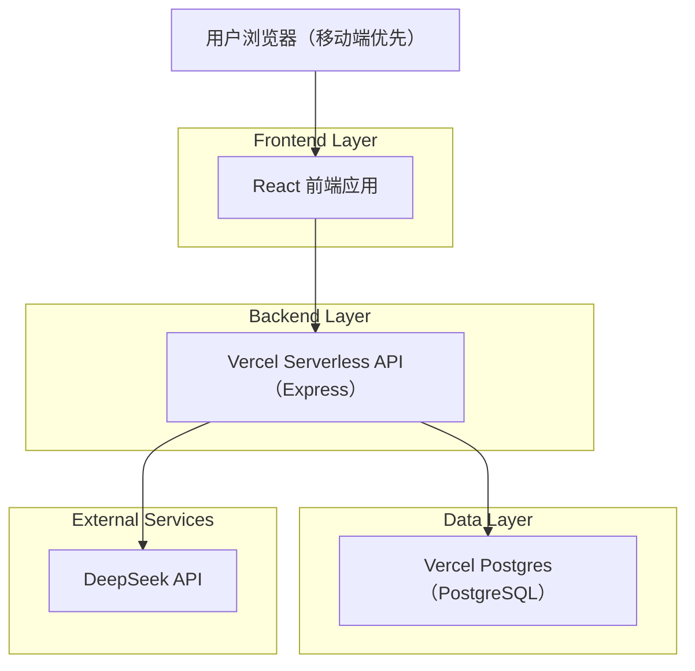
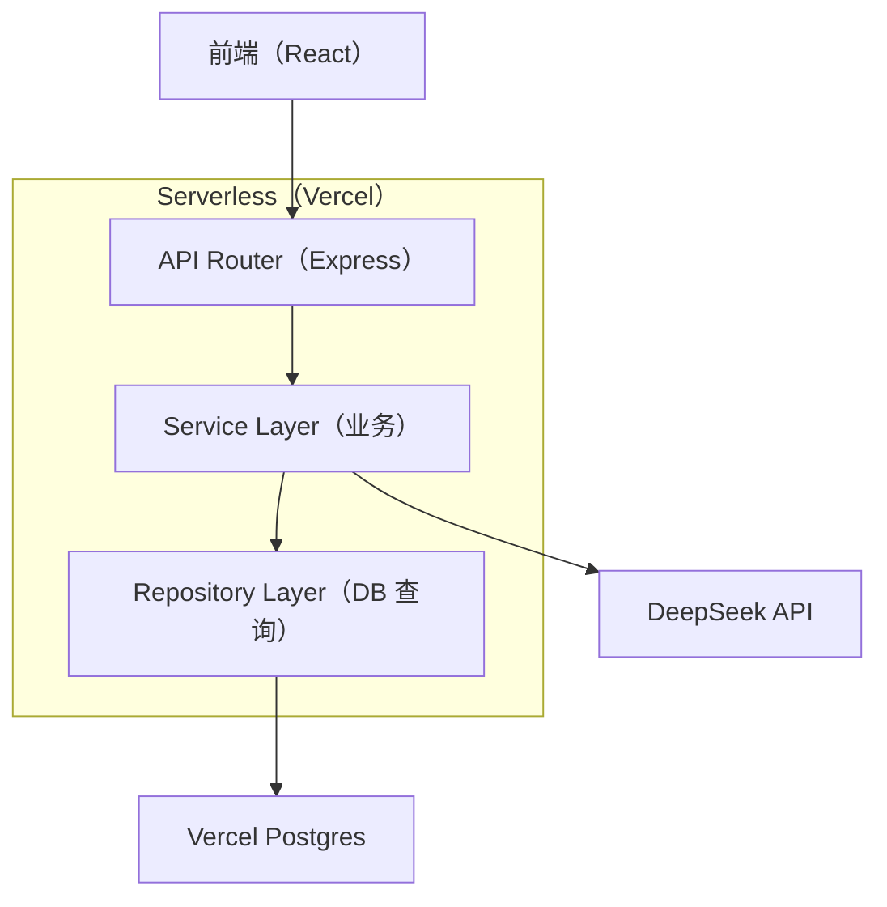

## 1.Architecture design

## 2.Technology Description
- Frontend: React + TypeScript + vite + tailwindcss + shadcn/ui + react-router
- State: React Query（服务端状态）+ Zustand（本地 UI 状态）
- Backend: Node.js + Express（Vercel Serverless Functions）
- Database: Vercel Postgres（PostgreSQL）
- Auth: JWT Access Token + Refresh Token（优先 HttpOnly Cookie）

## 3.Route definitions
| Route | Purpose |
|-------|---------|
| / | 首页/对局大厅（本次 UI 改版重点） |
| /game/:id | 对局进行页（视觉规范对齐） |
| /result | 结算/复盘页（视觉规范对齐） |
| /auth | 登录页（视觉规范对齐） |

## 4.API definitions (If it includes backend services)
本次为 UI 改版，不新增 API；仅要求前端样式与组件层抽象更清晰（例如 Header、容器、卡片、按钮状态）。

## 5.Server architecture diagram (If it includes backend services)

