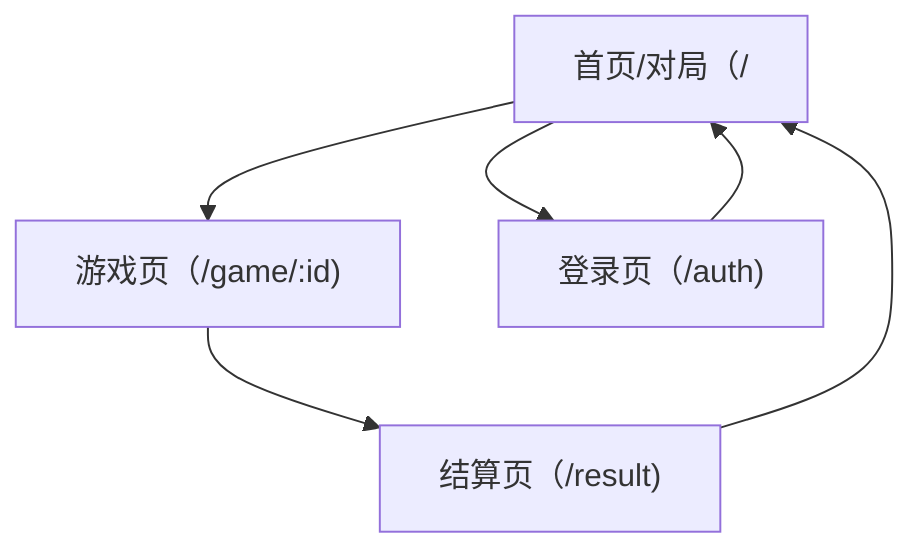

## 1. Product Overview
在不改变现有路由结构与玩法前提下，对当前 Home（大厅）与全局 Header 进行 UI 改版。
目标风格：参考 minimax.io 的“简洁科技感信息层级”，同时保留深色神秘基调与金色强调色。

## 2. Core Features

### 2.1 Feature Module
本次 UI 改版涉及以下主要页面：
1. **首页/对局（/）**：首屏信息层级、开局引导、故事卡片列表视觉与排版、空/加载态样式。
2. **游戏页（/game/:id）**：对话区域、操作区（提问/发送/提示/解锁等）容器与层级的统一视觉规范。
3. **结算页（/result）**：结算信息的卡片化展示、复盘信息的分区与可读性。
4. **登录页（/auth）**：表单容器、输入与按钮样式与全站一致。

### 2.2 Page Details
| Page Name | Module Name | Feature description |
|-----------|-------------|---------------------|
| 全局（App Shell） | 主题与布局规范 | 定义全站深色神秘主题：背景/字体/边框/阴影/渐变/高亮色；统一容器宽度与页面留白；确保移动端优先并向上扩展到桌面。 |
| 全局（Header） | 顶部导航 | 保留现有导航项与路由（对局/结算/登录）；改为“轻量科技风”样式：细分割线、低对比度悬浮态、可读的当前态；移动端支持折叠为图标/按钮组（不新增页面）。 |
| 首页/对局（/） | Hero 首屏 | 强化标题、简介与引导文案的信息层级；加入“主 CTA（开始对局/选择故事）”的视觉焦点；保持文案不泄露汤底。 |
| 首页/对局（/） | 故事卡片列表 | 卡片使用简洁科技风（低饱和描边、轻玻璃质感、微渐变/微噪点可选）；卡片信息层级清晰（标题/一句话概览/标签或难度占位）；点击整卡进入对局。 |
| 首页/对局（/） | 状态与反馈 | 为加载、空列表、错误提示提供一致的组件样式（暗色底+细边框+主色按钮）。 |
| 游戏页（/game/:id） | 对话容器与输入区 | 保持现有交互不变；统一卡片/面板的边框、圆角、间距；对消息气泡与系统提示的对比度与可读性做规范。 |
| 结算页（/result） | 复盘信息排版 | 将“结果、接近度、缺失方向、关键提问节点”等内容按分区卡片呈现，提升扫读性；保持深色神秘与金色强调。 |
| 登录页（/auth） | 登录表单样式 | 表单容器、输入框、按钮、错误提示与全站主题一致；按钮主次层级清晰。 |

## 3. Core Process
- 你从 Header 进入“对局（/）”，浏览首屏说明与故事卡片列表。
- 你点击任意故事卡片，进入对应的游戏页（/game/:id）开始问答。
- 你在游戏过程中可跳转至“结算（/result）”查看复盘信息（保留现有导航结构）。
- 你可从 Header 进入“登录（/auth）”进行登录（UI 统一但不改变流程）。

