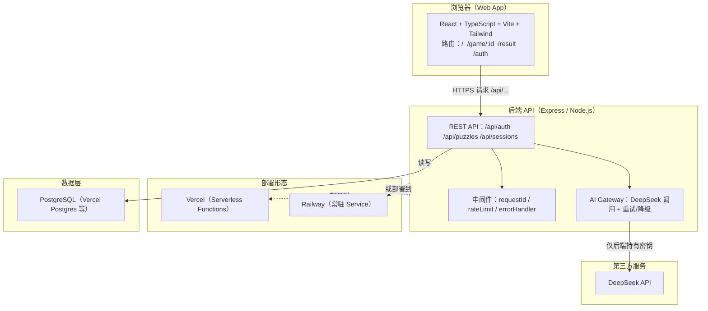
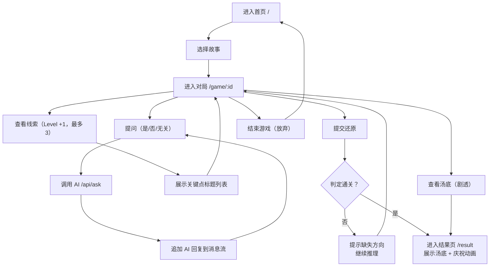
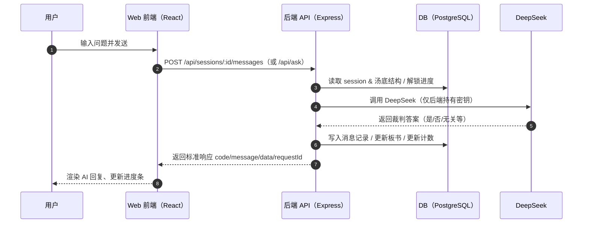

# 项目架构图（前后端分离）

本文件用于打卡：画出项目架构图，并帮助理解“为什么需要后端”。

## 架构图（Mermaid）



## 架构图（纯文本）

```text
[浏览器 Web App]
  React + TypeScript + Vite + Tailwind
  路由：/  /game/:id  /result  /auth
          |
          | HTTPS 请求（/api/...）
          v
[后端 API（Express）]
  部署：Vercel Serverless Functions 或 Railway
  模块：auth / puzzle / session / ai gateway
  中间件：requestId / rateLimit / errorHandler
          |
          | 数据读写
          v
[数据库：PostgreSQL]
          |
          | 第三方调用（密钥仅在后端）
          v
[DeepSeek API]
```

## 核心流程图（游戏流程）



## 核心流程图（前后端请求链路）



## 为什么需要后端（简要）

- 保护密钥：DeepSeek API Key 只能放服务端，不能暴露给前端
- 规则一致性：同局同问同答、解锁层级、结算原因等需要服务端统一口径
- 防剧透：完整汤底 Level 4 只能在结算页展示，应由后端控制下发
- 持久化：用户、对局、收藏、复盘、统计等需要数据库与 API
- 稳定与风控：统一错误码、限流、审计日志、内容预警更适合在后端实现
